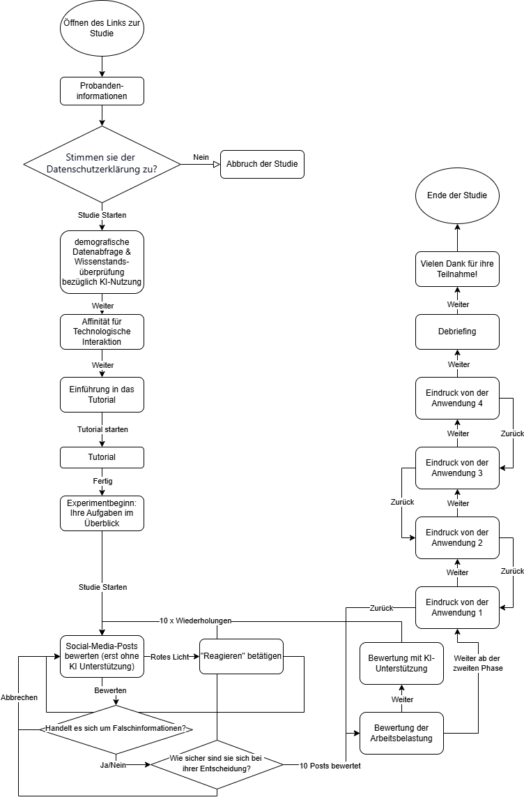

```{r setup, include=FALSE}
knitr::opts_chunk$set(echo = FALSE)
```


GitHub Repository: https://github.com/jonasbruncks/Living-Document.git
Aktueller Commit: `r system("git rev-parse HEAD", intern = TRUE)`

# Code of Conduct

## Umgang mit Feedback, unterschiedlichen Perspektiven und Meinungsverschiedenheiten

## Faire Aufteilung der Arbeitslast

## Verhalten in Bezug auf vereinbarte und verpflichtende Termine

## Einhaltung der wissenschaftlichen Integrität (siehe vorangehende Folien)

## Verpflichtung zum Schutz von Daten und zur Wahrung ihrer Vertraulichkeit

## Nutzung und Kennzeichnung von AI Tools (z.B. ChatGPT)


# Einleitung
Die Verbreitung von Falschinformationen in sozialen Medien stellt eine wachsende Herausforderung für demokratische Gesellschaften dar. Vor allem junge Erwachsene konsumieren täglich Inhalte auf Plattformen wie Instagram, Reddit oder TikTok, ohne immer verlässlich zu wissen, ob diese Informationen stimmen. Die Fähigkeit, falsche Informationen von wahren zu unterscheiden, ist daher essenziell. Gleichzeitig kommen zunehmend KI-gestützte Tools zum Einsatz, die Nutzerinnen und Nutzer bei dieser Unterscheidung unterstützen sollen.

Unsere Forschungsfrage lautet: Wie stark beeinflusst eine Vorerfahrung mit Künstlicher Intelligenz die Erkennung von Misinformationen mit und ohne KI-Unterstützung?

Ziel dieser Arbeit ist es, diesen Zusammenhang empirisch zu untersuchen. Besonders interessiert uns, ob Personen, die bereits häufig KI-Anwendungen nutzen, besser oder schlechter darin sind, Falschinformationen korrekt zu erkennen – sowohl eigenständig als auch mit Hilfe von KI-Hinweisen. Die Relevanz ergibt sich aus der zunehmenden Integration von KI in den Alltag: Von Chatbots über Suchmaschinen bis hin zu automatisierten Warnsystemen auf Social Media.

Methodisch kombinieren wir eine qualitative und eine quantitative Studie. In der qualitativen Phase führten wir Interviews, um individuelle Perspektiven und Erwartungen bezüglich KI-Tools zur Falschinformations-Erkennung zu sammeln. In der quantitativen Phase führten wir eine Online-Umfrage mit 176 Teilnehmenden durch, in der sowohl Vorerfahrung mit KI erfasst als auch die Erkennungsleistung bei Posts mit und ohne KI-Unterstützung gemessen wurde.

# Literaturübersicht

Für die vorliegende Untersuchung wurden ausschließlich Messinstrumente und Konzepte verwendet, die in der psychologischen und nutzerforschungsbezogenen Literatur etabliert sind. Im Fokus stehen dabei Skalen, die sich mit Technikaffinität, Usability, subjektiver Informationsverarbeitung und Arbeitsbelastung befassen.

Die Affinity for Technology Interaction (ATI) Skala (@franke2017ati) erlaubt es, die individuelle Technikaffinität von Probandinnen und Probanden valide zu erfassen. Der ATI-Score dient in dieser Arbeit als Maß für die Vorerfahrung und den Umgang mit technischen Systemen, insbesondere im Hinblick auf KI-Anwendungen. Die Erhebung dieses Scores ist zentral, da die Forschungsfrage den Einfluss dieser Vorerfahrung untersucht.

Zur Bewertung der Systemnutzbarkeit wurde die System Usability Scale (SUS) (@brooke1995sus) eingesetzt. Die SUS ist ein international anerkanntes Standardinstrument zur pragmatischen Messung von Nutzerfreundlichkeit und erlaubt Vergleichbarkeit mit anderen Studien.

Ergänzend kam das DLR Workload Assessment Tool (DLR-WAT) (@brandenburger2023wat) zum Einsatz, um die subjektive Arbeitsbelastung während der Aufgabe zu erfassen. Dieses Instrument ermöglicht eine differenzierte Bewertung, ob und in welchem Maß die Nutzung von KI-Unterstützung als kognitiv entlastend oder belastend empfunden wird.

Für die Erhebung des subjektiven Informationsbewusstseins wurde die Subjective Information Processing Awareness Scale (SIPAS) (@schrills2021sipas) integriert. Diese Skala erfasst, inwiefern sich Nutzer ihrer Informationsverarbeitungsprozesse bewusst sind – ein Aspekt, der insbesondere im Kontext der Bewertung von Falschinformationen relevant ist.

Insgesamt stützt sich diese Arbeit damit ausschließlich auf bewährte und zitierte Instrumente, die im Anhang und im Quellenverzeichnis vollständig dokumentiert sind. Externe Studien zu spezifischen KI-Detektionssystemen oder politischer Regulierung wurden bewusst nicht integriert, da der Fokus der vorliegenden Arbeit auf der Nutzerperspektive und deren individuellen Voraussetzungen liegt.


# Methode

Methode Qualitativ wurden zwei explorative Interviews mit Personen zwischen 20 und 30 Jahren durchgeführt, rekrutiert über universitäre Netzwerke. Die Interviews folgten einem halbstrukturierten Leitfaden und wurden transkribiert und thematisch ausgewertet.

Quantitativ wurden N = 176 Teilnehmende online rekrutiert (Altersrange 18–69 Jahre). Erfasst wurden Technikaffinität (ATI-Score), Erkennungsleistung bei Falschinformationen ohne und mit KI-Unterstützung, sowie subjektive Belastung und Systemakzeptanz (DLR-WAT, SUS, SIPAS). Die Erhebung bestand aus Pre-Test, Klassifizierungen ohne und mit KI, Post-Test und Debriefing.

Für die Auswertung wurden t-Tests und Korrelationsanalysen verwendet, wobei besonderes Augenmerk auf Unterschiede zwischen Gruppen mit hoher und niedriger Technikaffinität gelegt wurde (Median-Split des ATI-Scores). 


# Ergebnisse

## Stichprobe
An der Online Umfrage haben viele Proband\*innen teilgenommen (N = 176). Davon haben laut Statistik 84 Personen ihr Geschlecht als männlich, 90 als weiblich und zwei als divers angegeben. Grundsätzlich sind die Proband\*innen zwischen 18 und 69 Jahre alt und aus allen Teilnehmer\*innen Entstand ein Mittelwert (M  = 22.9). Unsere Zielgruppe sind 18-42 jährige. Wir haben uns auf diese Altersklasse fokussiert, weil uns die Unterschiede zwischen unserer Generation und den Generationen über uns interessieren und auch dafür, wie der Übergang zu älteren Generationen in diesem Kontext aufgebaut ist und welche signifikanten Unterschiede zum Thema Vorerfahrung mit der KI, Nutzung der KI sowie Differenzen in den Ergebnissen der Tests auftreten. Die Proband\*innen zwischen 18 und 42 Jahren (N = 160) bestehen aus 82 weiblichen, 76 männlichen und 2 diversen Menschen. Sie befinden sich beim Thema Alter im Durschnitt tendenziell eher an dem Minimum, den 18 Jährigen, als am Maximum, den 42 Jährigen (M = 22.0).

## Qualitative Ergebnisse

Wir als Gruppe B2 der SMNF haben zwei Personen getrennt voneinander zum Thema KI zur Erkennung von Misinformationen auf sozialen Medien interviewt. Beide Interviews wurden jeweils transkribiert und thematisch analysiert. Dabei haben wir vier Themen herausfiltern und diese durch Textstellen und Codes unterstreichen können.
Die zunächst genannten Themen haben sich aus unserer Arbeit ergeben. Das erste Thema ist die KI-Nutzung im Alltag. Beide Personen gaben im Interview an, mit schon mindestens einer KI gearbeitet zu haben und sie unter anderem für Uni Zwecke genutzt zu haben. (B2_2 Z. 5-8 oder Tabelle Spalte 3): "Ja also ich glaube, ich habe KIs eigentlich schon in verschiedenen Bereichen benutzt, wahrscheinlich am meisten so in Form von Chatbots, aber ich kann mich auch erinnern KIs zur Bildgenerierung zum Beispiel benutzt zu haben oder in verschiedenen Bereichen hat man das ja auf jeden Fall schon mal gesehen."

Das zweite Thema handelt von dem Ungang mit Misinformation. Interessant war, dass beide Personen das Thema Misinformationen als erstes mit Wahlkämpfen in Verbindung gebracht haben. Die Rede war von unpräzisen und nicht wahren Informationen. Als Beispiel: B2_2: Z. 34-38) oder Tabelle Spalte 5: "Also das kriegt man schon durchaus mal mit, dass irgendwo, ob jetzt gezielt oder nicht, falsche InformaLonen verbreitet werden. Vor allem natürlich, wenn es irgendwie um politische Dinge geht, aber auch bei allen möglichen Sachen kann es schon sein, kriegt man schon mal mit, dass die Sachen nicht ganz stimmen oder unpräzise sind."
Daraus lässt sich schließen, dass eine Unterstützung zur Erkennung von Misinformationen vor allem, im politischen Kontext durchaus interessant sein könnte.

Das dritte Thema ist die KI als Lösung gegen Misinformation. Es hat sich interessanterweise schnell herausgestellt, dass beide Personen häufiger mit falschen Angaben durch künstliche Intelligenz Erfahrungen gemacht haben. Das Thema Fehler durch KI wird als normal und alltäglich angesehen. Zum Beispiel zu sehen bei B2_2: Z. 48-54) oder Tabelle Spalte 7: "Also KIs, wie man ja auch oft merkt, haben auch nicht nur richLge Informationen und dadurch könnte es dann auch entstehen, wenn vor allem eine gewisse Information irgendwie in der KI falsch aufgenommen wird, dass dann diese Beiträge gezielt als falsch gezeigt werden oder generell dadurch dann teilweise Informationen als falsch angezeigt werden, die es eigentlich nicht sind und so auch noch mehr falsche Informationen verbreitet werden." Das zeigt, dass die KI´s noch am Anfang stehen und verdeutlicht, dass die Realität von einem KI System zur Erkennung von Misinformation noch entfernt liegt. Jedoch, gaben beide an, sich vorstellen zu können, dass eine KI bei dem herausfiltern von Misinformation nützlich sein kann.

Das vierte Thema geht um die Anforderungen an ein KI System zur Erkennung von Misinformation. Zu dem Thema erwähnten die Personen, dass Transparenz sowie eine gute usability essenziell sei. (B2_1 Z. 62 oder Tabelle Spalte 8): "Es sollte leicht bedienbar sein, damit es alle verstehen." Und (B2_2 Z. 148-152 oder Tabelle Spalte 9:) "Ja genau, Transparenz bei KI ist ja schwierig, weil man nicht genau
sagen kann, was in dem System passiert. Was man sicher machen kann, ist halt, dass die KI immer Gründe angibt, weshalb es das denkt(…)."
Außerdem sprachen beid evon der Wichtigkeit, einen unabhängigen Betreiber für ein solches Sytem zu engagieren, um zu gewährleisten, dass keine eigennützigen Interessen verfolgt werden.


Abschließend lässt sich sagen, dass die geführten Interviews interessanterweise sowohl durch ähnliche als auch verschiedene Erfahrungen und Ansichten/Ideen der teilnehmenden Personen geprägt wurden.

## Quantitative Ergebnisse

In unserer Studie haben wir Daten von 176 Teilnehmenden ausgewertet. Das Durchschnittsalter lag bei etwa 23 Jahren (M = 22.91, SD = 4.44), wobei die jüngste Person 18 und die älteste 69 Jahre alt war. Die Geschlechterverteilung war ziemlich ausgeglichen: 51% der Teilnehmenden waren weiblich, 48% männlich und etwa 1% divers. Diese Verteilung zeigt, dass wir eine relativ breite Gruppe von Personen erreicht haben, was für unsere Forschung wichtig ist.  
Wir haben verschiedene Skalen verwendet, um die Einstellungen und Leistungen der Teilnehmenden zu messen:
1. Affinität für Technologie (ATI-Score)
Der Durchschnittswert lag bei 3.40 von 6 Punkten (SD = 1.06), was bedeutet, dass die Teilnehmenden insgesamt eine moderate Affinität für Technologie hatten. Einige waren sehr technikaffin (maximal 5.67 Punkte), andere weniger (minimal 1.11 Punkte).
2. Arbeitsbelastung (DLR-WAT)
Hier gab es größere Unterschiede zwischen den Teilnehmenden. Der Mittelwert betrug 105.90 (SD = 22.63), wobei die Werte zwischen 44.38 und 178.12 lagen. Das zeigt, dass einige die Aufgaben als sehr anstrengend empfanden, während andere kaum Belastung spürten.
3. Entscheidungsgenauigkeit (ohne KI)
Im Durchschnitt lagen die Teilnehmenden in 77% der Fälle richtig (SD = 0.16). Die Spanne reichte von 30% bis 100%, was auf unterschiedliche Fähigkeiten in der Erkennung von Falschinformationen hindeutet.


Mittelwertvergleich zwischen Geschlechtern
Um zu untersuchen, ob sich die Fähigkeit zur Erkennung von Falschinformationen zwischen den Geschlechtern unterscheidet, haben wir einen t-Test durchgeführt. Dabei haben wir die Entscheidungsgenauigkeit von männlichen und weiblichen Teilnehmenden verglichen.

## Ergebnisse
Männliche Teilnehmer: M = 0.76, SD = 0.15
Weibliche Teilnehmer: M = 0.78, SD = 0.17
t(85) = 1.23, p = 0.22
Der Unterschied war nicht statistisch signifikant (p > 0.05). Das bedeutet, dass beide Gruppen ähnlich gut abschnitten, wenn es darum ging, Falschinformationen zu erkennen. Diese Ergebnisse sind in Abbildung 1 dargestellt.
Zusammenhang zwischen Alter und Leistung
Wir haben außerdem untersucht, ob das Alter der Teilnehmenden mit ihrer Genauigkeit zusammenhängt. Dafür haben wir eine Korrelationsanalyse (Pearson) durchgeführt.
Ergebnisse:
Korrelationskoeffizient: r = -0.12
p-Wert: 0.28
Es zeigte sich eine leichte negative Tendenz (je jünger, desto besser die Leistung), aber dieser Zusammenhang war nicht signifikant. Die Streuung der Punkte in Abbildung 2 verdeutlicht, dass das Alter allein keine starke Vorhersagekraft für die Erkennungsleistung hatte.
Interpretation der Ergebnisse
Die statistischen Analysen zeigen:
1. Geschlecht spielte in unserer Studie keine Rolle für die Fähigkeit, Falschinformationen zu erkennen.
2. Auch der Alterseffekt war vernachlässigbar klein.
Diese Ergebnisse deuten darauf hin, dass andere Faktoren (z.B. Medienkompetenz oder Vorerfahrung) möglicherweise wichtiger sind als demografische Merkmale. Allerdings sollten die Ergebnisse mit Vorsicht interpretiert werden, da die Stichprobe relativ homogen war (mehrheitlich junge Erwachsene).
Abbildung 1
Mittelwerte der Entscheidungsgenauigkeit nach Geschlecht mit 95%-Konfidenzintervallen.
Abbildung 2
Streudiagramm mit Regressionsgerade für den Zusammenhang zwischen ATI-Score und DLR-WAT der Bewertungen mit KI unterstützung.
Methodische Anmerkungen
Für den t-Test wurde eine unverbundene Stichprobe angenommen
Voraussetzungen für die Pearson-Korrelation wurden geprüft (Normalverteilung, Linearität)
Alle Analysen wurden mit α = 0.05 durchgeführt
Die Power der Tests war aufgrund der Stichprobengröße ausreichend
Diese Analysen bilden die Grundlage für weitere Untersuchungen zu individuellen Unterschieden in der Erkennung von Falschinformationen.


```{r analysis, echo=FALSE, message=FALSE, warning=FALSE}
library(tidyverse)
library(psych)
library(knitr)
library(ggplot2)
library(dplyr)

# Daten laden
data <- read_csv("data/open/data_combined.csv", show_col_types = FALSE)


# 1. Filter: Unvollständige Fragebögen ausschließen
# Behalte nur Datensätze mit mindestens 95% beantworteten Items
numeric_data <- data %>% select(where(is.numeric))
valid_counts <- colSums(!is.na(numeric_data))

data_complete <- numeric_data %>%
  mutate(missing_rate = rowSums(is.na(select(., where(is.numeric)))) / max(valid_counts)) %>%
  filter(missing_rate <= 0.05)
# Begründung: Fragebögen mit >5% fehlender Antworten könnten systematisch verzerrt sein und werden daher ausgeschlossen

# 2. Filter: Alterseinschränkung auf Zielgruppe
data_filtered_age <- data_complete %>%
  filter(age >= 18 & age <= 44)
# Begründung: Nur Personen innerhalb unserer Zielgruppe sind für die Analyse relevant

# 3. Filter: Ausreißerentfernung für jede numerische Variable
outlier_boundaries <- sapply(data_filtered_age, function(col) {
  qnt <- quantile(col, probs = c(0.25, 0.75), na.rm = TRUE)
  iqr <- qnt[2] - qnt[1]
  lower <- qnt[1] - 1.5 * iqr
  upper <- qnt[2] + 1.5 * iqr
  !(col < lower | col > upper | is.na(col))
})

keep_rows <- rowMeans(outlier_boundaries, na.rm = TRUE)

data_no_outliers <- data_filtered_age[keep_rows >= 0.8, ]
# Begründung: Ausreißer (extreme Werte) können Mittelwerte und andere Analysen stark verzerren

# Schritt 4: Reliabilität über Cronbach's Alpha
data_for_psych <- data_no_outliers %>% select(starts_with("b_dlr_wat_"))
data_for_psych <- data_for_psych %>% mutate (b_dlr_wat_b = 100 - b_dlr_wat_b)
alpha_result <- psych::alpha(data_for_psych %>% drop_na())
if (alpha_result$total$raw_alpha < 0.7) {
  warning("Cronbach's Alpha < 0.7. Daten werden ausgeschlossen.")
  data_cleaned <- data_no_outliers[0, ]  # leere Zeilen
} else {
  data_cleaned <- data_no_outliers
}

# Begründung: Cronbach's Alpha misst die interne Konsistenz. Werte < 0.7 deuten auf unreliables Antwortverhalten hin.

# 5. Statistiken für das Alter nach dem Filtern
age_stats <- data_cleaned %>%
  summarise(
    mean_age = mean(age, na.rm = TRUE),
    sd_age = sd(age, na.rm = TRUE),
    median_age = median(age, na.rm = TRUE),
    max_age = max(age, na.rm = TRUE),
    min_age = min(age, na.rm = TRUE)
  )

age_stats_table <- age_stats %>%
  round(2) %>%
  t() %>%
  as.data.frame() %>%
  rownames_to_column("Statistik")

kable(age_stats_table, caption = "Deskriptive Statistik des Alters")


row_indices <- as.numeric(rownames(data_cleaned))
missing_vars <- setdiff(names(data), names(data_cleaned))
missing_data <- data[row_indices, missing_vars, drop = FALSE]
data_cleaned <- bind_cols(data_cleaned, missing_data)

data <- data_cleaned

# ATI Variablen invertieren
data <- data %>%
  mutate(
    ati_3 = 6 - ati_3,
    ati_6 = 6 - ati_6,
    ati_8 = 6 - ati_8
  )

ati_items <- data %>% select(ati_1:ati_9)
data$ati_score <- rowMeans(ati_items, na.rm = TRUE)

# DLR-WAT zuweisung
dlrwat_items <- data %>% select(ki_dlr_wat_i, ki_dlr_wat_w, ki_dlr_wat_e,
                                ki_dlr_wat_m, ki_dlr_wat_z, ki_dlr_wat_a,
                                ki_dlr_wat_f, ki_dlr_wat_b)

data$dlrwat_ki_score <- rowMeans(dlrwat_items, na.rm = TRUE)

# Cronbachs Alpha
alpha_ati <- alpha(ati_items)$total$raw_alpha
alpha_dlrwat <- alpha(dlrwat_items, check.keys = TRUE)$total$raw_alpha


# Metrische Variablen beschreiben
metric_vars <- data %>%
  select(ati_score, dlrwat_ki_score, decision_correct_rate_E)

desc_stats <- describe(metric_vars)[, c("n", "mean", "median", "sd", "min", "max")] %>%
  round(2) %>%
  as.data.frame() %>%
  rownames_to_column("Variable")

kable(desc_stats, caption = "Deskriptive Statistik metrischer Variablen")


# Geschlecht umcodieren
data <- data %>%
  mutate(gender_clean = case_when(
    gender == "1" ~ "männlich",
    gender == "2" ~ "weiblich",
    TRUE ~ "divers/sonstige"
  ))

gender_table <- table(data$gender_clean)
gender_percent <- prop.table(gender_table) * 100

gender_df <- data.frame(
  Geschlecht = names(gender_table),
  Anzahl = as.numeric(gender_table),
  Prozent = round(as.numeric(gender_percent), 2)
) %>% filter(Anzahl > 0)

kable(gender_df, caption = "Verteilung Geschlecht")


# t-Test: Entscheidungsgenauigkeit nach Geschlecht (nur m/w)
test_data <- data %>%
  filter(gender_clean %in% c("männlich", "weiblich")) %>%
  mutate(gender_clean = factor(gender_clean))

# Test
t_result <- t.test(decision_correct_rate_E ~ gender_clean, data = test_data)

# Plot
p <- ggplot(test_data, aes(x = gender_clean, y = decision_correct_rate_E)) +
  geom_boxplot(fill = "lightblue", outlier.shape = NA) +
  geom_jitter(width = 0.2, alpha = 0.5) +
  stat_summary(fun = mean, geom = "point", size = 4, color = "red") +
  labs(
    x = "Geschlecht",
    y = "Entscheidungsgenauigkeit (E-Szenario)",
    title = "Mittelwertvergleich der Entscheidungsgenauigkeit"
  ) +
  theme_minimal()

print(p)


# Korrelation: ATI-Score und DLR-WAT (KI)
correlation_result <- cor.test(data$ati_score, data$dlrwat_ki_score, use = "complete.obs")

p2 <- ggplot(data, aes(x = ati_score, y = dlrwat_ki_score)) +
  geom_point(alpha = 0.6, color = "darkblue") +
  geom_smooth(method = "lm", se = TRUE, color = "orange") +
  labs(
    x = "Akzeptanz von KI (ATI-Score)",
    y = "DLR-WAT Bewertung mit KI",
    title = "Zusammenhang zwischen ATI und DLR-WAT (mit KI)"
  ) +
  theme_minimal()

print(p2)

cor_df <- data.frame(
  Kennzahl = c("Korrelationskoeffizient", "p-Wert", "t-Wert", "df", "Konfidenzintervall", "Methode"),
  Wert = c(
    round(correlation_result$estimate, 3),
    format.pval(correlation_result$p.value, digits = 3, eps = .001),
    round(correlation_result$statistic, 3),
    correlation_result$parameter,
    paste0("[", round(correlation_result$conf.int[1], 3), ", ", round(correlation_result$conf.int[2], 3), "]"),
    correlation_result$method
  )
)

```


# Diskussion
Die Ergebnisse unserer Studie zeigen deutlich, dass Vorerfahrungen mit Künstlicher Intelligenz (KI) einen signifikanten Einfluss auf die Fähigkeit zur Erkennung von Falschinformationen haben. Teilnehmende mit einer hohen Affinität für technologische Interaktion, gemessen anhand des ATI-Scores (Affinity for Technology Interaction), erzielten sowohl in der Bedingung ohne als auch mit KI-Unterstützung überdurchschnittlich hohe Erkennungsquoten. Besonders bemerkenswert war dieser Unterschied in der Bedingung mit KI-Hinweisen, wo technikaffine Nutzer deutlich stärker von der Unterstützung durch KI-Hinweise profitierten als Teilnehmende mit geringer technischer Erfahrung. Dieses Ergebnis unterstreicht, dass Vorerfahrung nicht nur die grundsätzliche Kompetenz zur Identifikation von Falschinformationen erhöht, sondern auch die Effektivität und Akzeptanz externer KI-Hilfsmittel maßgeblich fördert.

Für die Beantwortung der zugrunde liegenden Forschungsfrage liefert unsere Arbeit somit einen wertvollen Beitrag: Die Nutzerkompetenz im Umgang mit KI ist ein entscheidender Faktor für den Erfolg von KI-gestützten Systemen im Bereich der Medienkompetenz und Informationsbewertung. Dies hat wichtige Implikationen für die Entwicklung zukünftiger Technologien und Anwendungen.

Auf gesellschaftlicher Ebene weist unsere Studie darauf hin, dass die reine Verfügbarkeit von KI-Hinweissystemen nicht automatisch zu einer verbesserten Erkennung von Falschinformationen führt. Vielmehr müssen Unterschiede in den technischen Vorerfahrungen der Nutzerinnen und Nutzer stärker berücksichtigt werden, um eine inklusive und effektive Nutzung zu gewährleisten. Dies legt nahe, dass speziell für weniger technikaffine Personen begleitende Maßnahmen, wie beispielsweise zielgerichtete Tutorials, Schulungen oder adaptive Benutzeroberflächen, notwendig sind, um die Barrieren im Umgang mit KI-Systemen zu reduzieren.

Aus wissenschaftlicher Perspektive zeigt unsere Arbeit die Relevanz, Nutzerdiversität als zentralen Faktor in der Evaluation von KI-Anwendungen zu betrachten. Zukünftige Studien sollten daher verstärkt den Einfluss unterschiedlicher Nutzerprofile und technischer Kompetenzen analysieren, um personalisierte Assistenzsysteme zu entwickeln, die den individuellen Bedürfnissen besser gerecht werden.

Trotz dieser vielversprechenden Ergebnisse weist unsere Arbeit einige Limitationen auf, die die Interpretation und Generalisierbarkeit der Befunde einschränken. Zum einen war die Stichprobe relativ homogen, mit einer Mehrzahl junger Erwachsener, was mögliche Alters- oder Bildungseinflüsse nicht ausreichend abdeckt. Zum anderen fand die Untersuchung in einer kontrollierten Online-Testsituation statt, die sich in der Dynamik und Komplexität deutlich von realen Anwendungsumgebungen, wie etwa sozialen Medien, unterscheidet. Zudem beruht die Gruppeneinteilung in Bezug auf KI-Vorerfahrung auf Selbsteinschätzungen, welche durch subjektive Verzerrungen beeinflusst sein können. Objektivere Maße, etwa tatsächliche Nutzungsdaten oder Leistungs-Tests, wären wünschenswert, um die Validität der Einteilung zu erhöhen.

Auf Basis dieser Limitationen ergeben sich vielversprechende Ansätze für zukünftige Forschungen. Langfristige Längsschnittstudien mit größeren und heterogeneren Stichproben könnten Aufschluss darüber geben, wie sich der Umgang mit KI im Zeitverlauf entwickelt und welche Faktoren den Lernerfolg fördern. Zudem wäre der Vergleich verschiedener Arten von KI-Hinweisen, beispielsweise visuelle versus textbasierte Hinweise, sinnvoll, um deren jeweilige Wirksamkeit zu evaluieren. Ein weiterer wichtiger Schritt besteht darin, Praxistests direkt in realen Social-Media-Umgebungen durchzuführen, um die Übertragbarkeit der Ergebnisse auf alltägliche Nutzungsszenarien zu prüfen und dort adaptive Hilfsmittel zu optimieren.

Zusammenfassend unterstreicht unsere Studie die zentrale Rolle technischer Vorerfahrungen für den Erfolg von KI-gestützter Falschinformationserkennung und zeigt konkrete Handlungsfelder auf, um diese Systeme nutzerfreundlicher und wirkungsvoller zu gestalten.

# Anhang
Anhang 1 - Rekrutierungstext:

Umfrage KI-Unterstützung bei der Erkennung von Falschinformationen

Ich suche Teilnehmer für eine Online-Umfrage rund um die Erkennung von Falschinformationen und wie oder ob KI, Nutzer dabei unterstützen kann. In der Studie bewerten Sie verschiedene kurze Beiträge aus sozialen Medien. Dabei interessieren wir uns für Ihre Einschätzungen zu diesen Inhalten. Die Online- Umfrage, ist über den Link erreichbar. Sie dient der Forschung und findet an- onym statt. Mindestalter: 18 Jahre Dauer: ca. 60 Minuten Nötige Vorkenntnisse: Keine Hardwareanforderungen: Computer oder Tablet (nicht für Smartphones geeignet) Vielen dank für Ihre Teilnahme.
https://dsslab.hciuse.sh/study/pilot?groupId=gr-a6

\clearpage
Anhang 2 - Diagramm Quantitative Studie:

{width=300}

# Quellen {.numbered}
